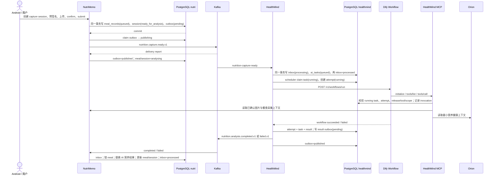

# 餐食 AI 分析推送链路

本文说明生产链路中每一次数据库和 Kafka 状态变化，以及 HealthMindControl 如何在不停止业务服务的情况下逐阶段暂停、放行和观察。

## 端到端时序

## 各阶段持久化变化

| 阶段 | PostgreSQL 变化 | Kafka 变化 | 可观察的正常状态 |
|---|---|---|---|
| 图片提交 | `nutri.meal_capture_sessions` 进入 `ready_for_analysis`；`meal_records.analysis_status=queued`；新增 `nutri.integration_outbox(pending)` | 无 | 三项在一次事务中出现 |
| Nutri 发布 | outbox `pending → publishing → published`；成功后 session/meal 进入 `analysing` | `nutrition-capture-ready` offset 增加 | 发布失败为 `failed` 并设置重试时间 |
| HM 消费 | 新增 `healthmind.integration_inbox`；校验后新增 `ai_tasks(queued)`；inbox 变 `processed` | HealthMind 消费组 offset 前进 | 同一 event_id 最多一个 inbox/task |
| 调度执行 | task `queued → running`；新增 `ai_task_attempts(running)` | 无 | attempt_no 递增，deadline/timeout 可计算 |
| MCP 工具 | 新增/更新 `ai_tool_invocations`；只返回最小上下文 | 无 | task、attempt、release、scope 均匹配 |
| Dify 成功 | attempt/task `succeeded`；新增 `ai_task_results` 与 HM outbox `pending` | 尚无 | result hash 与输出 schema 对应 |
| Dify 失败 | attempt `failed/timed_out`；可重试则 task 回 `queued`；耗尽则 task `failed` + failure outbox | 尚无 | failure_code/category 可定位 |
| HM 发布结果 | HM outbox `pending → publishing → published` | completed 或 failed topic offset 增加 | delivery report 可定位 partition/offset |
| Nutri 回写 | 新增 Nutri inbox；锁定 meal 后写 items/nutrients/summary，meal/session `completed` 或 `failed` | Nutri 消费组 offset 前进 | inbox `processed`，客户端列表不再“等待 AI” |

## 使用链路实验台

实验台不是“一键跑完”。先创建 debug run，填入已知的 `user_id`、`meal_id`、`capture_session_id`、`event_id`、`task_id` 或 `trace_id`；之后每个边界分别点击预览和执行。

1. `Nutri outbox 暂停/放行` 控制真实 Nutri 发布器何时看见 capture-ready。
2. `直接投递 capture-ready` 用原 outbox payload 绕过发布器并添加 `x-hmc-debug-run` header；不会改业务消费组 offset。
3. `HealthMind task 暂停/放行` 只操作 `queued` 任务的调度时间，避免与真实 scheduler 抢占 running 任务。
4. `直接调用 Dify` 的 App API Key 只存在于当前内存请求，不写 SQLite、JSONL 或业务表。
5. `直接调用 MCP` 同理；可用 `initialize`、`tools/list`、`tools/call` 定位认证、schema 或工具错误。
6. `HealthMind result 暂停/放行` 控制结果 outbox 的重试时间，由真实发布器完成结果 Kafka 投递。
7. 右侧“实时证据”读取 task、attempt 和双端 outbox。调试运行与步骤结果保存在 `var/debug/control.sqlite3`，业务数据不自动删除。

所有阶段写入 `requester_service=HealthMindControl`（创建调试任务时）或 `x-hmc-debug-run`（直接 Kafka）作为来源标记。普通修复操作仍保留历史记录，不覆盖成功结果。

## 故障定位顺序

先查数据库中最后一个已经发生的状态，再查下一个边界：

1. Nutri outbox 没有：提交事务未成功，问题在上传/confirm/submit。
2. outbox `published` 但 HM inbox 没有：查 Kafka topic、partition、HealthMind group lag。
3. HM inbox `processed` 但 task 没有：属于事务/约束异常，应查服务日志；正常实现二者同事务。
4. task `queued`：查 production release、App Key、调度时间。
5. attempt `running` 超时：查 Dify 网络与 workflow run；只能恢复最新 attempt。
6. Dify 报 MCP authentication：重新授权 Dify MCP 连接，确认 Authentik redirect URI、client/scope。
7. HM outbox `published` 但 Nutri inbox 没有：查结果 topic 与 Nutri group lag。
8. Nutri inbox `processed` 但餐食仍 analysing：查人工修订保护、meal/capture 状态一致性和回写事务日志。

## 相关文档

- [../AGENTS.md](../AGENTS.md) — 本模块（HealthMindControl）导航：页面、API、调试能力与安全边界。
- [../doc/README.md](./README.md) — 本模块公开文档入口。
- 链路两端：[../../NutriMemo/AGENTS.md](../../NutriMemo/AGENTS.md)（发布方/回写方）、[../../HealthMind/AGENTS.md](../../HealthMind/AGENTS.md)（消费方/执行方）。
- [../../Orion/AGENTS.md](../../Orion/AGENTS.md) — MCP 取数的另一来源（最小营养健康上下文）。
- [../../integration-contracts/AGENTS.md](../../integration-contracts/AGENTS.md) — 本链路事件的字段契约（含物理 topic 与 event_type 的区别）。
- [../../AGENTS.md](../../AGENTS.md) — 仓库规范、阅读导航与项目背景。
